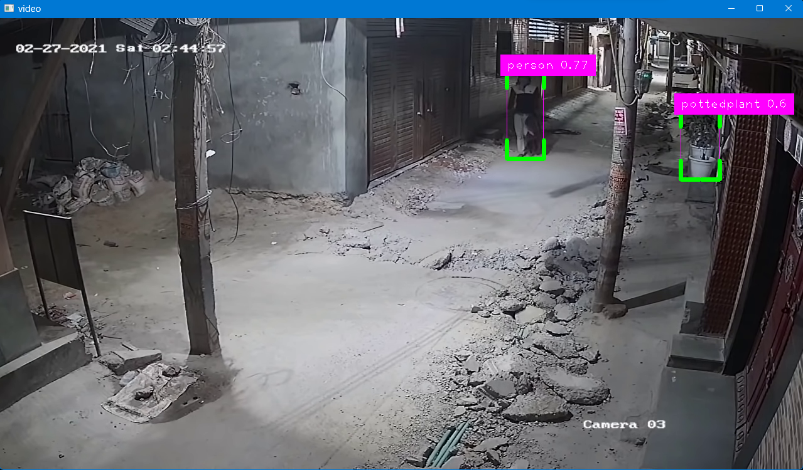

# Person Detection and Alert System Using YOLOv8

This project is a person detection system built using YOLOv8 and OpenCV. The application processes video input, detects persons in the frames, and plays an alert sound whenever a person is detected. It uses pygame for non-blocking audio playback to ensure smooth operation. This system is designed for use in monitoring restricted areas, where government or security agencies may need to ensure no unauthorized personnel are present.
## Features

- **Real-time Person Detection**: Detects persons in a video feed (webcam or pre-recorded video).
- **Alert System**: Plays an alert sound whenever a person is detected.
- **Smooth Playback**: Uses `pygame` to handle audio without blocking the main application.
- **YOLOv8 Integration**: Utilizes the powerful YOLOv8 model for object detection.
- **Restricted Area Monitoring**: Suitable for use in government or agency-controlled restricted areas to ensure security.

## Demo

 <!-- Replace with your actual demo GIF or screenshot -->

## Requirements

- Python 3.7+
- GPU support recommended for faster processing.

### Python Libraries

The required libraries are listed in `requirements.txt`. Install them using:

```bash
pip install -r requirements.txt
